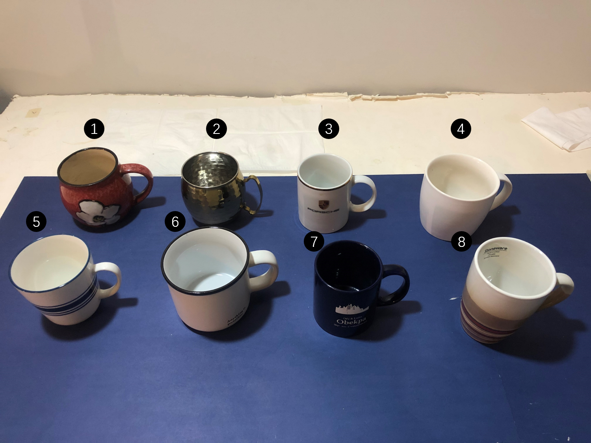
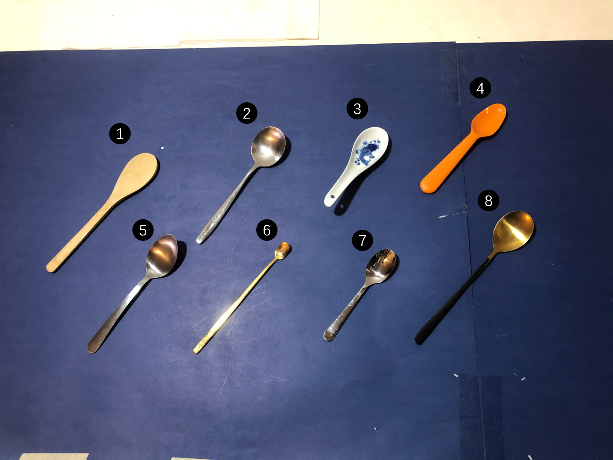

# Overview

The objective of this experiment is to test the generalizability of AffKp on object's variety of instances. We mainly select the mug, spoon and knife as the test object set.
Each set has 8 instances, which vary in geometry, color and texture. Since the mug and cup share the similar geometry and affordance category (_wrap-grasp_), we aggregate to the mug set a cup set consisting of 5 different instances.

# Object set

## Mug&Cup

## Spoon

## Knife

# Detection result

## Mug&Cup

### Mug No.1

### Mug No.2

### Mug No.3

### Mug No.4

### Mug No.5

### Mug No.6

### Mug No.7

### Mug No.8

### Cup No.1

### Cup No.2

### Cup No.3

### Cup No.4

### Cup No.5

### Multiple cups

## Spoon

### No.1

### No.2

### No.3

### No.4

### No.5

### No.6

### No.7

### No.8

## Knife

### No.1

### No.2

### No.3

### No.4

### No.5

### No.6

### No.7

### No.8

# Disucssion

## Mug & Cup
As seen in the above figures, AffKp provides robust affordance keypoint detection over the mug and cup test objects set. The key reason is the similar geometry between different mug and cup instances, modulo the handle. Since AffKp takes the RG-D image as input, which captures geometric information, it can provide accurate and robust affordance keypoint detection for different mug and cup instances. Furthermore, keypoint networks are input agnostic. They can be provided inputs of arbitrary size or resolution. When this nuisance factor is included in the training set, the network learns to be robust to sizing. Other networks with constrained input dimensions do not have this visual processing affordance to exploit.

The visually separable, multi-object implementation depicted as the last test case for the mug+cup object set uses this latter processing affordance. The first pass through the network provides a segmentation of the objects and their affordances, which are then grouped for each object to create an object-specific bounding box. Each object image sub-region is cropped and run through the network a second time to arrive at the final affordance segmentation and keypoint outputs. If desired, an object detector with bounding box or bounding region estimation (such as an oriented bounding box) could be used instead, for these objects or any other objects with (in principle) recognizable affordances.

## Spoon
For the spoon set, AffKp provides good detection results for the both _grasp_ and _scoop_ parts. The network correctly detects the keypoints across the spoon instances. The length of the spoon or width of a spoon's _scoop_ affordance region does not influence the keypoint outcomes. 

The spoon does have flip symmetry, which leads to keypoint 3-4 swaps for the _grasp_ affordance associated to the handle. Keypoints 3 and 4 are not always labeled with a consistent planar handed-ness. The result is that the recoverd 3D frame will have the local z-axis point up or down depending on whether keypoints 3 and 4 are swapped. The keypoints 3 and 4 of the grasp affordance share the similar regional features, which may be difficult to overcome without additional contextual information. That said, the flipped keypoints do not affect the experiment performance since the top-down grasp estimator re-processes the reference frame to arrive at a grasp compatible orientation.
A similar observation holds for the _scoop_ affordance.

## Knife
For the knife set, we include additional knives commonly found in kitchens (or in cafeterias for the plastic one) but not in the training data set. These knives are better called cleavers or butcher knives; they have long, wide blades. These knives differ from those in the annotated [dataset](https://github.com/ivalab/AffKpNet/blob/master/readme/dataset_visualization.md), which tend to have a blade width to handle width ratio close to unity. There are some knives in this category with a higher ratio, but not as high as in the additional testing knife set described here. 
 
Another significant similarity for the knives in the annotated dataset is the difference in colors between the handle and blade parts. 
We include some knives whose blade and handle have the same color, which may increase the difficulty of differentiating the two parts.
Lastly, considering all knives in the dataset are made of metal, we add one plastic knife with entirely white body, for which the _cut_ and _grasp_ parts have a more subtle difference.

For the two Chinese-style butcher knives (No. 4 and 5), we attach two figures with detection results per each instance. AffKp provides detection results for the _cut_ and _grasp_ parts in one scenario but misses the _cut_ part in the second. As the width of the knife grows closer to its length and away from its handle's width, the knife blade starts to resemble a plate or other larger flat surface. This intermediate geometry (not a typical blade, not a typical plate) may mislead the network.

The same problem occurrs for the No.1 knife with an all black body. For the No. 3 knife, AffKp can't detect the cut part. AffKp treats the entire knife as the grasp part and predict the grasp affordance keypoints for it. The main reason may be that the blade part is too similar to the handle part. The primary means to differentiate is through the width discontinuity, which may not be an internal feature of the network representation for knives. Adding more knives from the confounding classes may remedy the problem and induce the necessary internal representation needed to differentiate the knive sub-parts.
