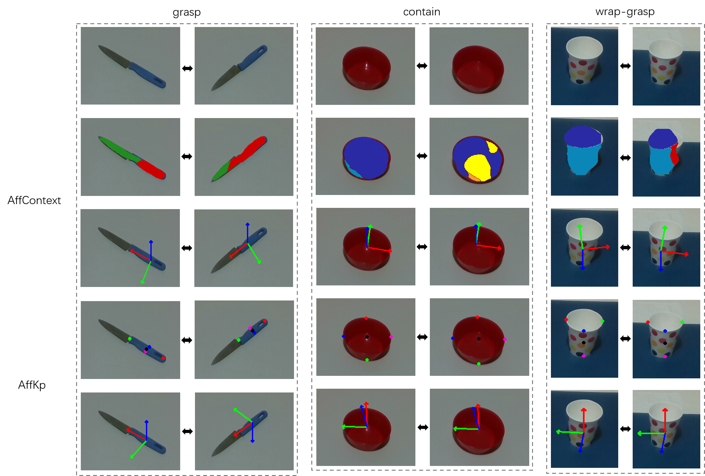

# Overview
Based on predicted segmentation and keypoint, we've demonstrated the comparsion of performance robustness between _AffContext_ and _AffKp_ for objects under different views in the paper. 
To make further comparison in the 3D space, we convert 2D predictions (segmentation or keypoints) to 3D execution-related information. This file documents the investigation in 3D space.

# Rationale
## AffContext
To convert 2D segmentation to 2.5D/3D pose, it requires to compute the center and the principle axis of the affordance mask. By computing the centroid of the mask, the 3D
operational location can be obtained by the corresponding depth image. By the least squares polynomial fit technique, the principle axis is computed for the mask, which is 
the red-axis in the following figure.

## AffKp
The way that _AffKp_ converts 2D affordance keypoints to 3D pose can be referred to [experiment.md](https://github.com/ivalab/AffKpNet/blob/master/readme/experiment.md).

# Result

# Discussion
Origins change for knife and bowl.

(1) Changed axis due to the segmentation (2) By applying least squares polynomial fitting, the principle axis can be signficantly changed as the camera views. 
